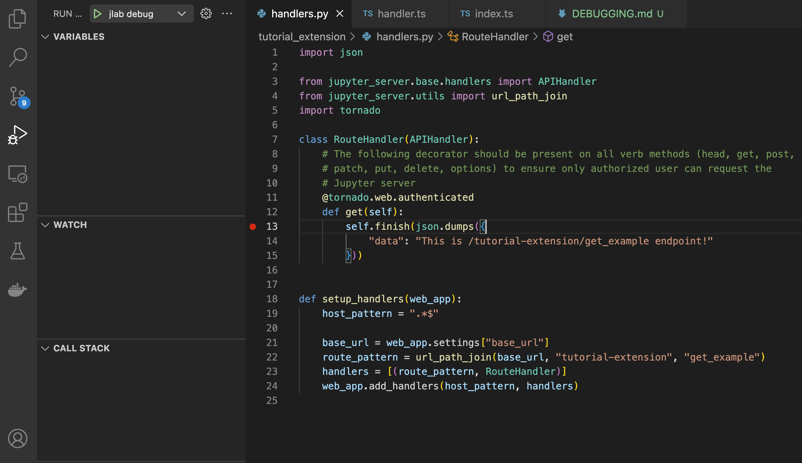

# Debugging JupyterLab Extensions
Debugging is essential for discovering errors in the code, investigating unexpected results as well as understanding the code path and learning about the internals of your extension. There are several ways to debug JupyterLab extensions. In this tutorial, we will go into details of setting up and debugging inside the Visual Studio Code as it provides a rich debugger interface right within the code, so you can navigate the code without leaving the editor. We will look at debugging both the front-end (typescript/javascript) and the server (python) extension.

**Note**: This guide assumes that you are working with a a project setup with the [JupyterLab Extension Cookiecutter](https://github.com/jupyterlab/extension-cookiecutter-ts) repo.

## Debugging in Visual Studio Code

### Setup

Install the cookiecutter package

```shell
pip install cookiecutter
```

Make sure you are in the root dir of your extension, i.e., `developing-extensions-tutorial/examples/tutorial_extension`


Use the debug-config-cookiecutter

```shell
cookiecutter ../debug-config-cookiecutter
```

Go through the prompts, you can press `Enter` through all the prompts to select defaults. 
At the end of this, the debug config should be added inside the `.vscode` directory.

Install the debug dependencies

```shell
jlpm install
```

Build the project

```shell
jlpm build
```

At this point, your project should be setup for debugging.

### Setting breakpoints



### Launching JupyterLab for debugging


**Note**: In some instances, the chrome launcher is not able to refresh the browser window to load JupyterLab. In this case, you can manually go the browser window opened by the launcher and go the JupyterLab home page. http://localhost:9999

### Debugger interface


### Debugger interface (continued)


### Troubleshooting
- Report issues on https://github.com/jupyterlab/debug-config-cookiecutter/issues


### Other ways to debug

#### Front end extension (typescript/javascript)
- Use the browser directly to debug, chrome browser shown here
TODO: Add a screenshot to show the debugging in browser

#### Server Extension (python)
- Python's command line debugger (TODO: Add a screenshot)
    - Add `import pdb; pdb.set_trace()` in code where you want to debug
    - This will stop the code at the next statement inside the terminal console. 
      See the [pdb](https://docs.python.org/3/library/pdb.html) documentation to
      learn more about the cli options.
      
- IPython pdb, a better alternative to pdb (TODO: Add a screenshot)
    - Same interface as pdb, but nicer interactive output


